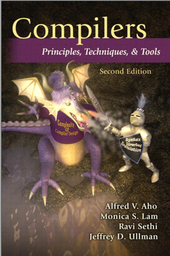

# Compiler-code

## Compiler Course Introduction

A compiler course in university introduces students to the design and implementation of compilers. It covers topics such as lexical analysis, syntax analysis, semantic analysis, intermediate representations, code generation, optimization, and compiler tools.

Key Topics Covered:
- Lexical Analysis: Tokenization, regular expressions, and finite automata.
- Syntax Analysis: Parsing, grammars, and parsing algorithms.
- Semantic Analysis: Meaning analysis, type checking, and symbol tables.
- Intermediate Representations: Three-address code, control flow graphs, and abstract syntax trees.
- Code Generation: Instruction selection, register allocation, and code emission.
- Optimization: Techniques to improve program efficiency.
- Compiler Tools and Techniques: Lex, Yacc/Bison, and other compiler construction tools.

Practical Project: Students implement a compiler for a small programming language.

Conclusion: The course provides a foundation in language design, parsing, and code generation, enabling students to understand programming languages and pursue careers in compiler development.

